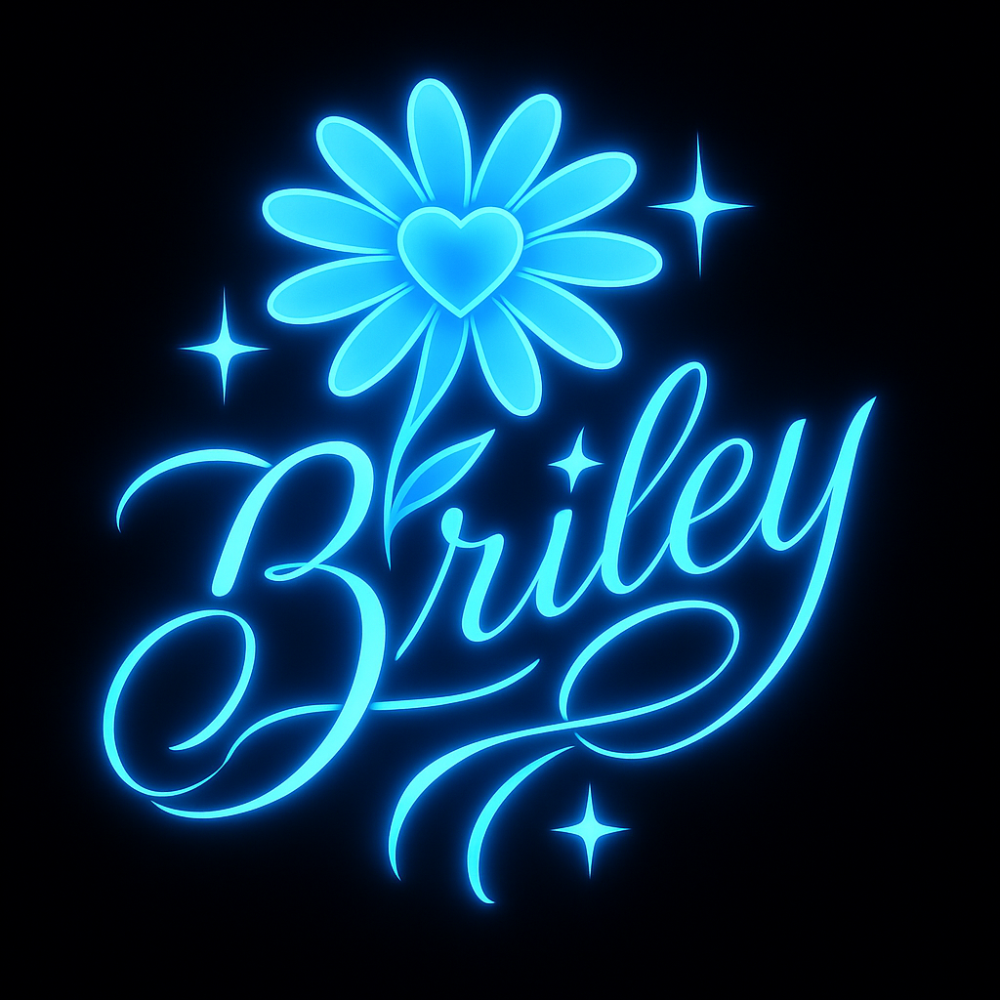

  

   

  <b>Briley</b>

# Dedication

This project is for my daughter.

Every entry, every line of code, every moment of doubt and defiance collected here is proof that I refused to quit.  
Not because I wanted applause. Not because I needed support.  
But because when the fire tried to take everything, you were the reason I walked through it.

Ashes to Code is not just a logbook. It is a record of survival, resilience, and truth.  
One day, you’ll read this and see not only what I built — but *why*.

Never give up. That’s the creed.

(( • ))
